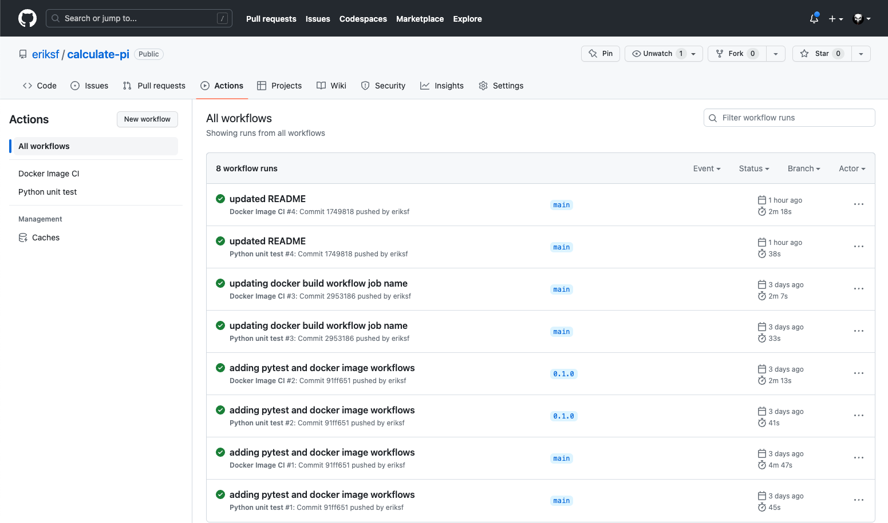
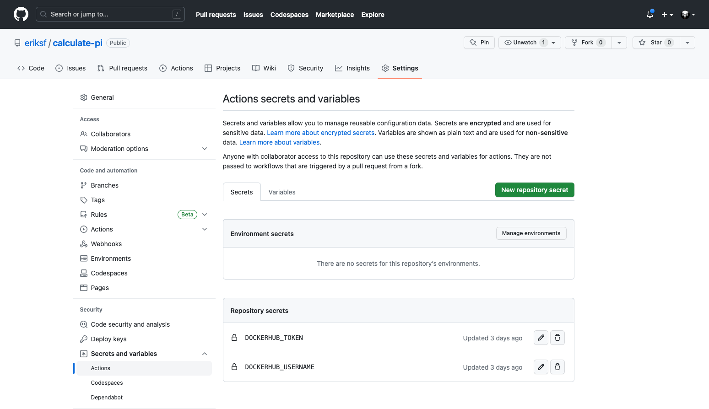
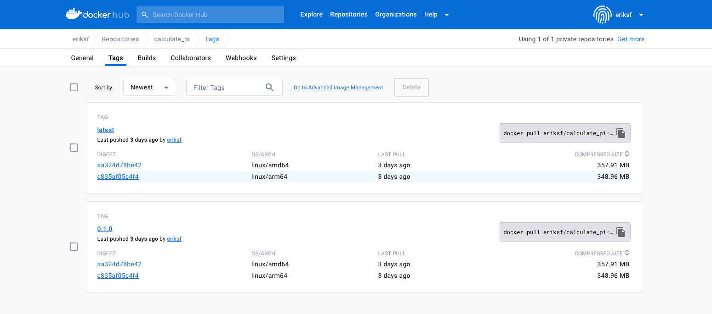

Continuous Integration
======================

In a multi-developer environment, typically no one person has complete knowledge
of the entire system, and multiple changes can be happening at the same time. Even
if the changes are made in different components, it is possible for something to
break when they are integrated.
The primary goal of Continuous Integration (CI) is to enable multiple developers
to work on the same code base while ensuring the quality of the final product.
After going through this module, students should
be able to:

* Identify the importance of CI to a large software system
* Choose a CI service that meets the needs of their software system
* Perform a testing CI workflow with GitHub Actions
* Perform a docker build / docker push CI workflow with GitHub Actions

An Example CI Workflow
----------------------

An "integration server" (or "build server") is a dedicated server (or VM) that
prepares software for release. The server automates common tasks, including:

* Building software binaries from source code (for compiled languages)
* Running tests
* Creating images, installers, or other artifacts
* Deploying/installing the software

We are ultimately aiming for the following "Continuous Integration" work flow or
process; this mirrors the process used by a number of teams working on "large"
software systems, both in academia and industry:

* Developers (i.e., you) check out code onto a machine where they will do their
  work. This could be a VM somewhere or their local laptop.
* They make changes to the code to add a feature or fix a bug.
* Once their work is done they add any additional tests as needed and then run
  all unit tests "locally" (i.e., on the same machine).
* Assuming the tests pass, the developer commits their changes and pushes to the
  origin (in this case, GitHub).
* A pre-established build server gets a message from the origin that a new commit
  was pushed.
* The build server:

  * Checks out the latest version
  * Executes any build steps to create the software
  * Runs unit tests
  * Starts an instance of the system
  * Runs integration tests
  * Deploys the software to a staging environment

If any one of the steps above fails, the process stops. In such a situation, the
code defect should be addressed as soon as possible.

Popular Automated CI Services
------------------------------

**Jenkins** is one of the most popular free open-source CI services. It is
server-based, and it requires a web server to operate on.

* Local application
* Completely free
* Deep workflow customization
* Intuitive web interface management
* Can be distributed across multiple machines / VMs
* Rich in features and plugins
* Easy installation thanks to the pre-installed OS X, Unix and Windows packages
* A well-established product with an excellent reputation

**TravisCI** is another CI service with limited features in the free tier, and a
comprehensive paid tier. It is a cloud-hosted service, so there is no need for
you to host your own server.

* Quick setup
* Live build views
* Pull request support
* Multiple languages and platforms support
* Pre-installed database services
* Auto deployments on passing builds
* Parallel testing (paid tier)
* Scaling capacity on demand (paid tier)
* Clean VMs for every build
* Mac, Linux, and iOS support
* Connect with Github, Bitbucket and more

**GitHub Actions** is a relatively new CI service used to automate, customize,
and execute software development workflows right in your GitHub repository.

* One interface for both your source code repositories and your CI/CD pipelines
* Catalog of available Actions you can utilize without reinventing the wheel
* Hosted services are subject to usage limits, although the free-tier limits are
  `fairly generous <https://docs.github.com/en/actions/learn-github-actions/usage-limits-billing-and-administration>`_
  (for now)
* Simple YAML descriptions of workflows, many templates and examples available
* It is a newer platform, so not as many features as some of the others, but it
  is quickly gaining steam

What Will We Do With CI?
------------------------

Two obvious and useful forms of CI we can incorporate into the development of our
projects with GitHub Actions include:

1) Automatically run our tests (with pytest) each time new code is
   pushed to GitHub
2) Automatically build a Docker image and push it to Docker Hub each time our
   code is tagged with a new release

Testing with GitHub Actions
---------------------------

To set up GitHub Actions in an existing repository, create a new folder as follows:

.. code-block:: console

   $ git clone git@github.com:eriksf/calculate-pi.git
   $ cd calculate-pi
   $ mkdir -p .github/workflows/

Within that folder we will put YAML files describing when, how, and what workflows
should be triggered. For instance, create a new YAML file (``.github/workflows/pytest.yml``)
to perform our testing with the following contents:

.. code-block:: yaml

   name: Python unit test

   on:
       push:
       workflow_dispatch:

   jobs:

     test:
       runs-on: ubuntu-latest

       steps:
         - uses: actions/checkout@v3

         - name: Set up Python 3.9
           uses: actions/setup-python@v4
           with:
             python-version: 3.9

         - name: Install Poetry
           uses: snok/install-poetry@v1
           with:
               virtualenvs-in-project: false
               virtualenvs-path: ~/.virtualenvs

         - name: Cache Poetry virtualenv
           uses: actions/cache@v3
           id: cache
           with:
             path: ~/.virtualenvs
             key: poetry-${{ hashFiles('**/poetry.lock') }}
             restore-keys: |
               poetry-${{ hashFiles('**/poetry.lock') }}

         - name: Install Dependencies
           run: poetry install
           if: steps.cache.outputs.cache-hit != 'true'

         - name: Test with pytest
           run: poetry run pytest --cov=calculate_pi

The workflow above runs our tests, and it is triggered on every push
(``on: [push]``). This particular workflow will run in an ``ubuntu-latest`` VM,
and it has 6 total ``steps``.

Some steps contain a ``uses`` keyword, which utilizes a pre-canned action from the
catalog of GitHub Actions. For example, the pre-canned actions might be used to
clone your whole repository or install Python3. The other steps contain a ``run``
keyword which are the commands to run on the VM. In the above example, commands are
run to checkout the repository, install python 3.9, install poetry, cache the virtualenv,
install dependencies, and run pytest.

Trigger the Integration
~~~~~~~~~~~~~~~~~~~~~~~

To trigger this integration, simply edit some source code, commit the changes,
and push to GitHub.

.. code-block:: console

   $ git add *
   $ git commit -m "made some changes"
   $ git push

Then navigate to the repo on GitHub and click the 'Actions' tab to watch the
progress of the Action. You can click on your saved workflows to narrow the view,
or click on a specific instance of a workflow (a "run") to see the logs.

   History of all workflow runs.

By looking through the history of recent workflow runs, you can see that each is
assigned to a specific commit and commit message. That way, you know
who to credit or blame for successful or errant runs.

Docker Hub Integration with GitHub Actions
------------------------------------------

Rather than commit to GitHub AND push to Docker Hub each time you want to
release a new version of code, you can set up an integration between the two
services that automates it. The key benefit is you only have to commit to one
place (GitHub), and you can be sure the image on Docker Hub will always be in sync.

We have also modified the Dockerfile from the containers module in our new poetry-based
calculate-pi python package to look like the following:

.. code-block:: Dockerfile

  FROM python:3.9.17-bookworm as poetry
  ENV POETRY_VERSION = "1.5.1"

  RUN pip install "poetry==${POETRY_VERSION}"

  WORKDIR /calculate_pi

  COPY pyproject.toml poetry.lock ./

  RUN poetry export -f requirements.txt --output requirements.txt --without-hashes

  COPY README.md \
       /calculate_pi/
  COPY calculate_pi /calculate_pi/calculate_pi/

  RUN poetry build

  FROM python:3.9.17-bookworm
  LABEL maintainer="Erik Ferlanti <eferlanti@tacc.utexas.edu>"

  # Update OS
  RUN apt-get update && apt-get install -y \
      vim-tiny \
      && rm -rf /var/lib/apt/lists/* /tmp/* /var/tmp/*

  # Configure Python/Pip
  ENV PYTHONUNBUFFERED=1 \
      PYTHONDONTWRITEBYTECODE=1 \
      PYTHONFAULTHANDLER=1 \
      PIP_NO_CACHE_DIR=off \
      PIP_DISABLE_PIP_VERSION_CHECK=on \
      PIP_DEFAULT_TIMEOUT=100

  WORKDIR /calculate_pi

  COPY --from=poetry /calculate_pi/requirements.txt .

  RUN pip install -r requirements.txt

  COPY --from=poetry /calculate_pi/dist/*.whl ./

  RUN pip install *.whl

  COPY README.md \
       /calculate_pi/

  CMD [ "calculate-pi", "--help" ]

Consider the following docker build workflow, located in ``.github/workflows/docker-image.yml``:

.. code-block:: yaml

  name: Docker Image CI

  on:
    push:
      branches: [ "main" ]
      tags: [ "*.*.*" ]
    pull_request:
      branches: [ "main" ]

  jobs:

    build-calculate-pi:
      runs-on: ubuntu-latest

      steps:
        - name: Checkout repository
          uses: actions/checkout@v3

        - name: Set up QEMU
          uses: docker/setup-qemu-action@v2

        - name: Set up Docker Buildx
          id: buildx
          uses: docker/setup-buildx-action@v2

        - name: Cache Docker layers
          uses: actions/cache@v3
          with:
            path: /tmp/.buildx-cache
            key: ${{ runner.os }}-buildx-${{ github.sha }}
            restore-keys: |
              ${{ runner.os }}-buildx-

        - name: Docker metadata
          id: meta
          uses: docker/metadata-action@v4
          with:
            images: eriksf/calculate_pi
            flavor: latest=true
            tags: |
              type=ref, event=branch
              type=ref, event=pr
              type=semver, pattern={{version}}

        - name: Login to DockerHub
          if: github.ref_type == 'tag'
          uses: docker/login-action@v2
          with:
            username: ${{ secrets.DOCKERHUB_USERNAME }}
            password: ${{ secrets.DOCKERHUB_TOKEN }}

        - name: Build and push image
          uses: docker/build-push-action@v4
          with:
            context: .
            platforms: linux/amd64,linux/arm64
            push: ${{ github.ref_type == 'tag' }}
            tags: ${{ steps.meta.outputs.tags }}
            labels: ${{ steps.meta.outputs.labels }}
            cache-from: type=local,src=/tmp/.buildx-cache
            cache-to: type=local,dest=/tmp/.buildx-cache-new,mode=max

        - name: Move cache
          run: |
            rm -rf /tmp/.buildx-cache
            mv /tmp/.buildx-cache-new /tmp/.buildx-cache

This workflow is triggered on pushes or pull_requests to the ``main`` branch or when a new tag is pushed
(``tag: - '*.*.*'``). As in the previous action, this one checks out the code. Then, it uses a couple of different
actions to set up QEMU (for multi-architecture builds), docker buildx, caching of the build layers,
and docker metadata to setup the repo name and version. It will attempt to use the ``docker/login-action``
to log in to Docker Hub on the command line only if the workflow is run based on a tag. The username and token
can be set by navigating to Settings => Secrets and variables => Actions => New Repository Secret within the project repository.

   Secrets are tied to specific repos.

Finally, this workflow will build the image for both the ``linux/amd64`` and ``linux/arm64`` platforms using
the build cache from previous runs if it exists (and hasn't changed). It will only push the image to docker Hub
if the workflow is run based on a tag. This uses the ``docker/build-push-action`` from the GitHub Actions catalog.

.. tip::

   Don't re-invent the wheel when performing GitHub Actions. There is likely an
   existing action that already does what you're trying to do.

Trigger the Integration
~~~~~~~~~~~~~~~~~~~~~~~

To trigger the build in a real-world scenario, make some changes to your source
code, push your modified code to GitHub and tag the release as ``X.Y.Z`` (whatever
new tag is appropriate) to trigger another automated build:

.. code-block:: console

   $ git add *
   $ git commit -m "made some changes"
   $ git push
   $ git tag -a 0.1.0 -m "release version 0.1.0"
   $ git push origin 0.1.0

By default, the git push command does not transfer tags, so we are explicitly
telling git to push the tag we created (0.1.0) to the remote (origin).

Now, check the online GitHub repo to make sure your change / tag is there, and
check the Docker Hub repo to see if your new tag has been pushed.

   New tag automatically pushed.

Additional Resources
--------------------

* `GitHub Actions Docs <https://docs.github.com/en/actions>`_
* `Demo Repository <https://github.com/eriksf/calculate-pi>`_
